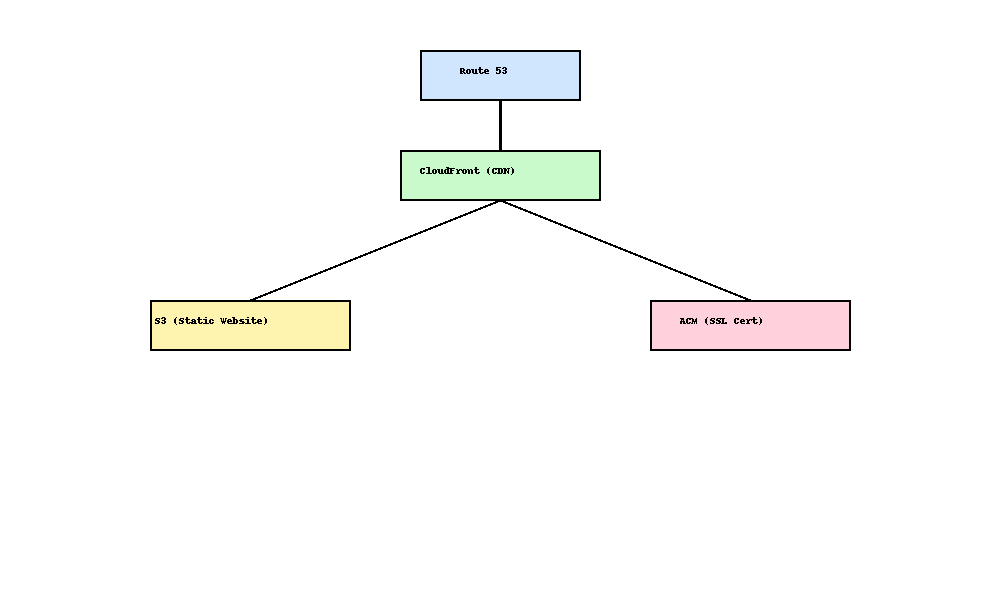

# AWS 静的Webサイト構成テンプレート

## 🔧 概要

このリポジトリは、以下のAWSサービスを使って構築した「高速・安定・SSL対応」の静的Webサイトの構成テンプレートです。

- ✅ Amazon S3（静的ウェブホスティング）
- ✅ CloudFront（CDN＋SSL）
- ✅ Route 53（ドメイン管理）
- ✅ AWS Certificate Manager（無料SSL証明書）

## 🧱 構成図

## 📄 含まれるファイル

| ファイル名        | 説明                      |
|------------------|---------------------------|
| `index.html`     | サンプルHTMLファイル（LPなどに使用可能） |
| `README.md`      | この構成の説明             |
| `構成図.png`     | アーキテクチャ図（draw.ioまたは画像）    |

## ✅ この構成が使える場面

- 企業・店舗のLP（ランディングページ）
- 自己紹介・ポートフォリオページ
- イベント・キャンペーン特設サイト
- 商品やサービスの紹介サイト

## 📌 特徴

- 高速＆安定  
- 月額コスト数十円〜  
- 独自ドメイン＋HTTPS対応  
- 変更も簡単で、将来的にCMS化も可能

---

📬 ご相談・ご依頼は以下からお気軽にどうぞ！

- 📘 Notion営業資料：  
  https://absorbing-sumac-5fc.notion.site/cloud-hayata-AWS-1f612fb23660809db7b7f73a8eb4b1bd?pvs=4

- 🐤 X（Twitter）：  
  https://x.com/cloud_hayata
